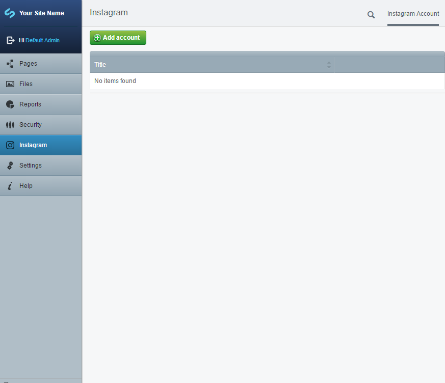
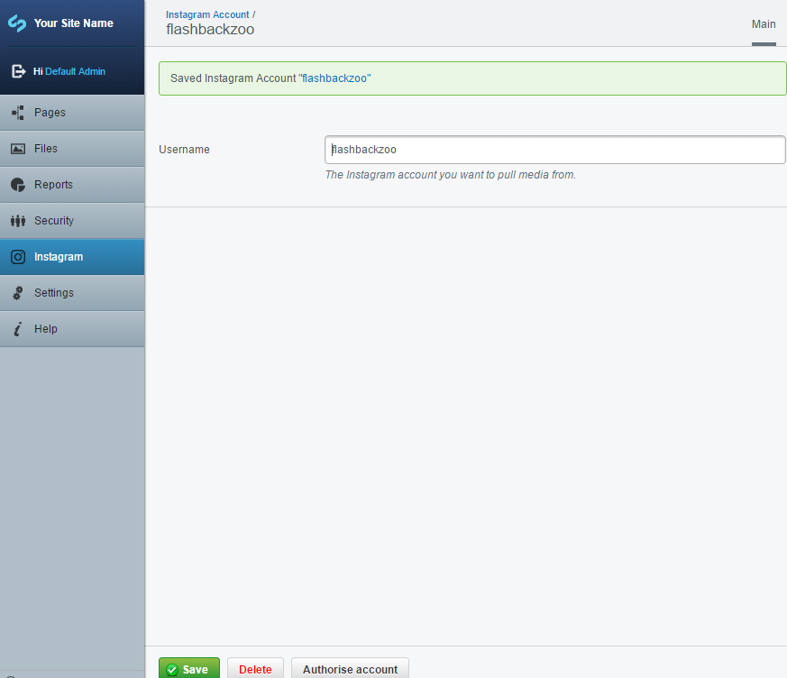
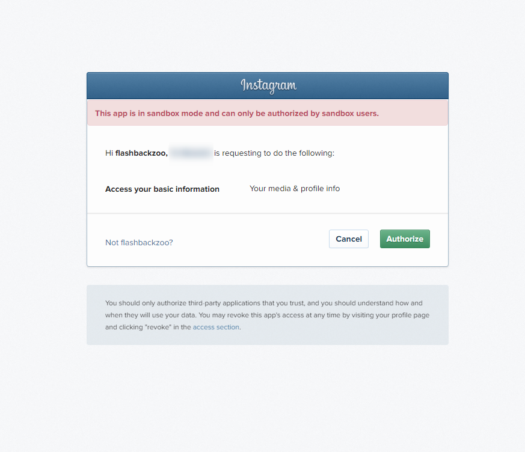
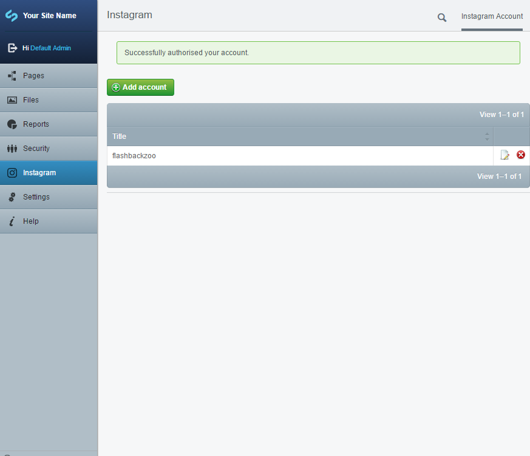
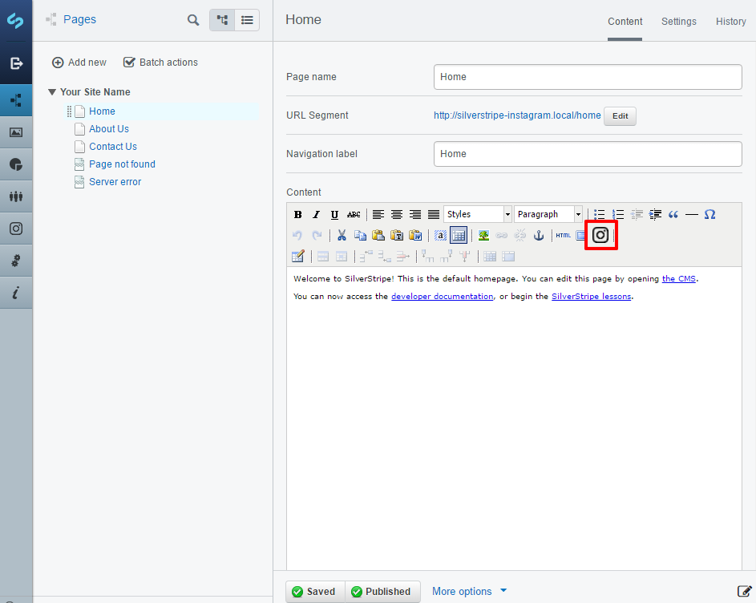
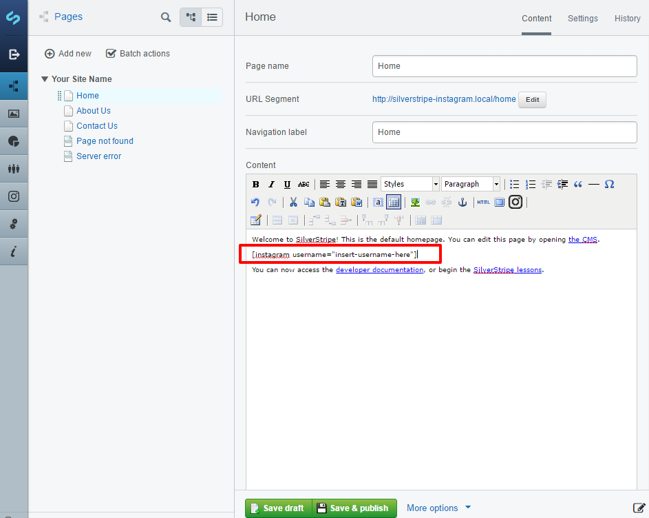

# User Guide

This guide steps you through the process of authorising an Instagram account and displaying media
from that account on a page in the CMS.

## Authorising an account

In order to display images and videos from an Instagram account on your site, you first need to
give your site's [Instagram client](https://www.instagram.com/developer/) permission to access
that account's media. You can do this by heading to the "Instagram" section in the CMS.

Click the "Add account" button and you will be taken to the below screen.

Enter the username for the instagram account you want to display and click the "Create" button.

__Note:__ If your Instagram client is running in
[Sandbox mode](https://www.instagram.com/developer/sandbox/) make sure the account name you add
here is also added to the list of Sandbox Users for that client.

After creating the account you will see an extra button added to the bottom of the screen called
"Authorise account". Click "Authorise account" and you will be taken to an Instagram authorisation
screen.

You may also be asked for your Instagram username and password, depending if you're
currently logged into Instagram or not.

After selecting "Authorize" you will be taken back to the CMS and see a success message.

Now you've successfully authorised an account, you can go ahead and display media from that
account on pages in the CMS.

## Adding media to pages

Once you have an authorised account, you can add Instagram media to page content, using a
Shortcode.

Head over to the "Page" section and choose a page you want to display Instagram media on.
Here I've selected the Home Page. Notice there's a new Instagram button added to the content
toolbar.

Clicking the Instagram button inserts a Shortcode into the content. This is where the media will
be displayed on the page. You can move the short code around using copy / paste.

All that's left to do is change the text "insert-username-here" to the username you authorised in the previous step.

Once you've done that, click the "Save & publish" button, and you will have Instagram content
displayed on your page.
